# Inmobiliarias — visualización 3D a partir de planos

Prototipo para comprobar si podemos producir visualizaciones arquitectónicas
de calidad comercial partiendo solo del plano de una vivienda. Todo se genera
por código con **Three.js + TSL**. No hay modelos 3D, texturas, HDRI ni
librerías externas aparte de `three`.

La interfaz tiene dos niveles de acceso sobre una única experiencia visual:

| Acceso | Qué ve |
|---|---|
| **Público** (web de la promotora) | Plano, Vivienda, vistas guiadas y navegación libre. Sin personalización ni precios de mejoras. Incluye el aviso "¿Ya eres comprador? Accede para personalizar tu vivienda." |
| **Comprador** (enlace privado de su vivienda) | Lo anterior, más **Personalizar**: opciones de su vivienda, precio, resumen tipo carrito y documento de selección en PDF |
| **Promotora** («Acceso profesional» + código de promotora) | Lo público, más los entregables comerciales: renders HD y plano comercial en PDF vectorial o PNG de alta resolución. Sin herramientas de producción |
| **Studio** («Acceso profesional» + código de Studio, solo producción) | Todo lo anterior, más la edición de ambientación, cámaras, acabados y precios, marca, biblioteca, interiorismo asistido, actualización de planos y exportación de datos. Ver [`docs/arquitectura-studio.md`](docs/arquitectura-studio.md) |

| | |
|---|---|
| 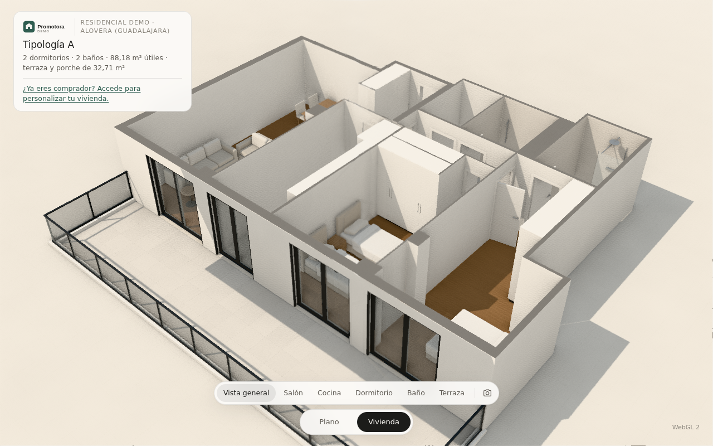 | 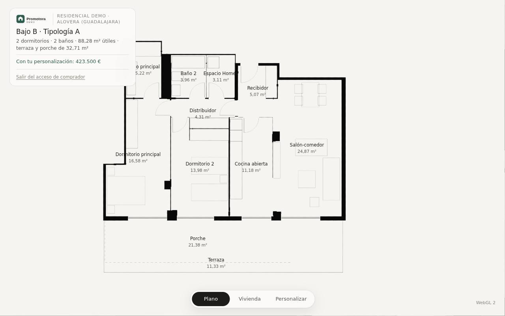 |
| 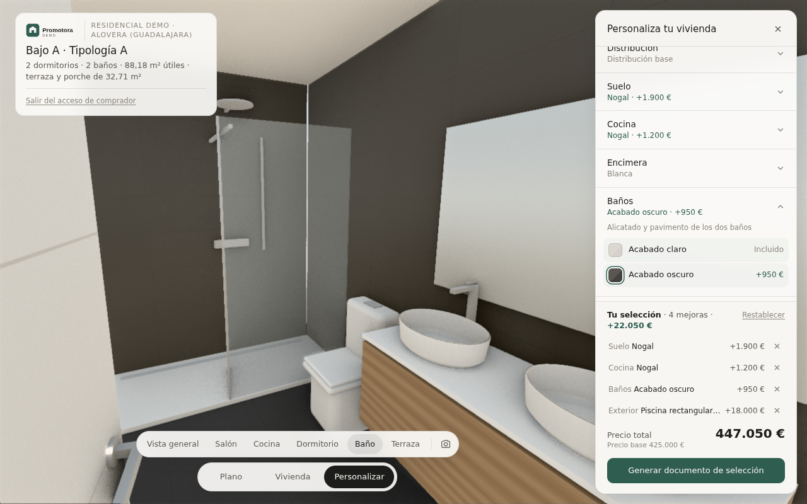 | 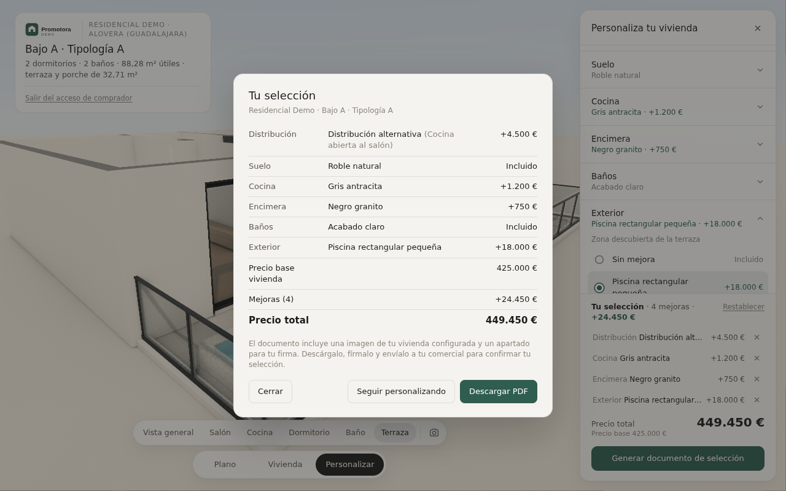 |
| 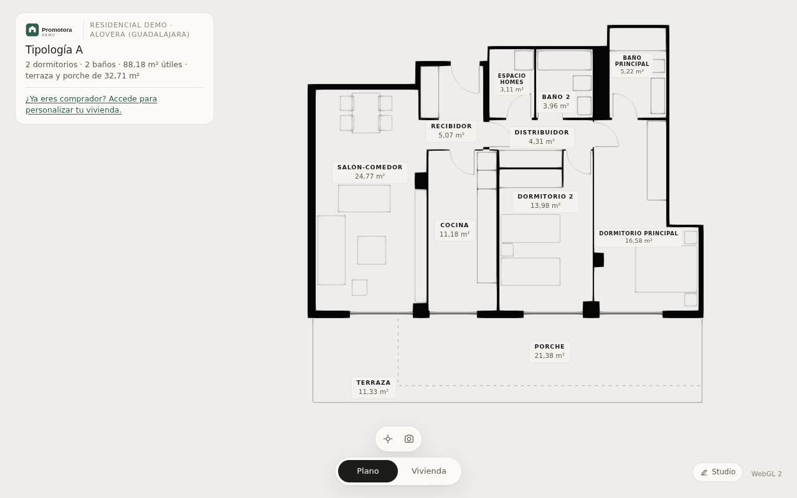 | 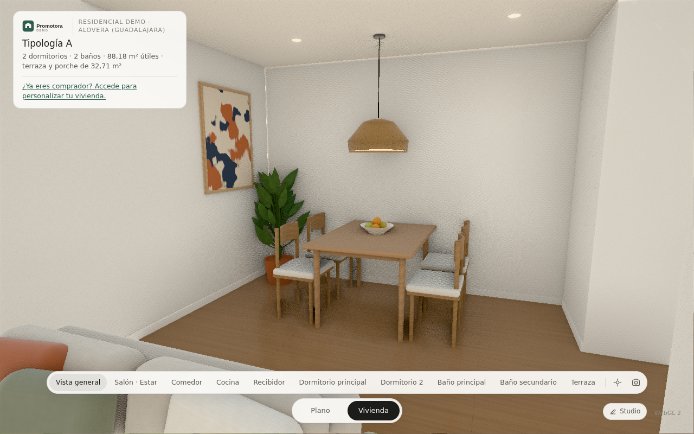 |
| 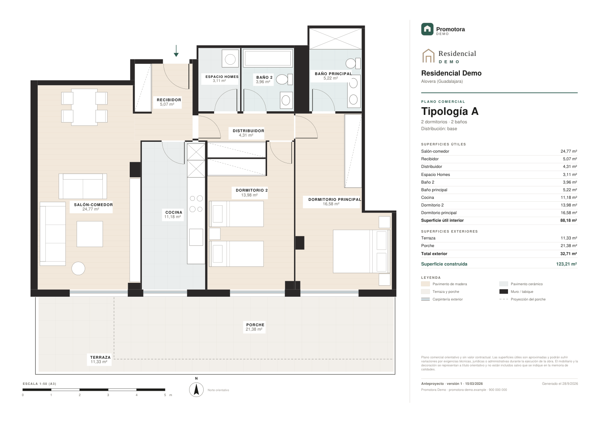 | 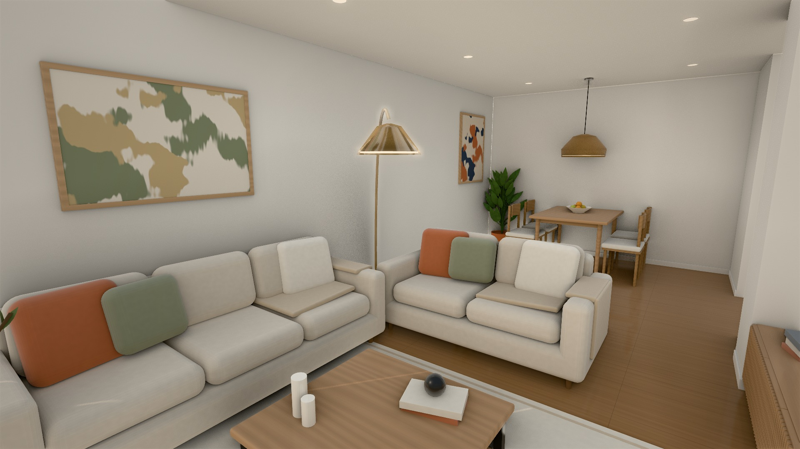 |
| 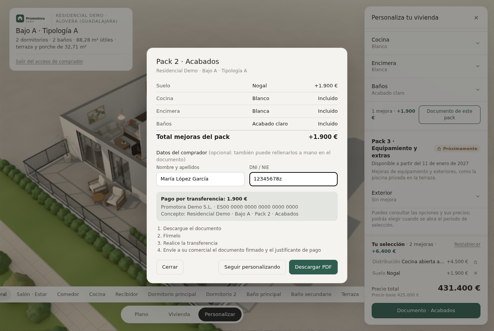 | 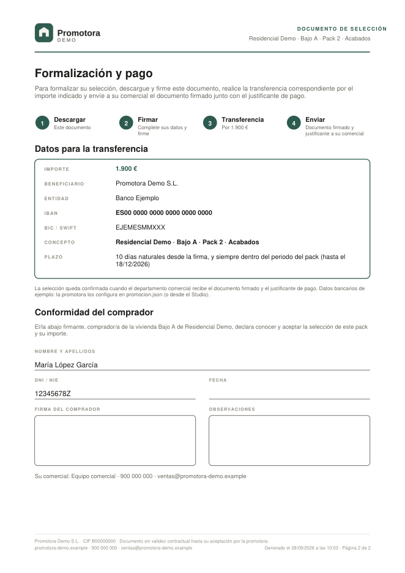 |
| 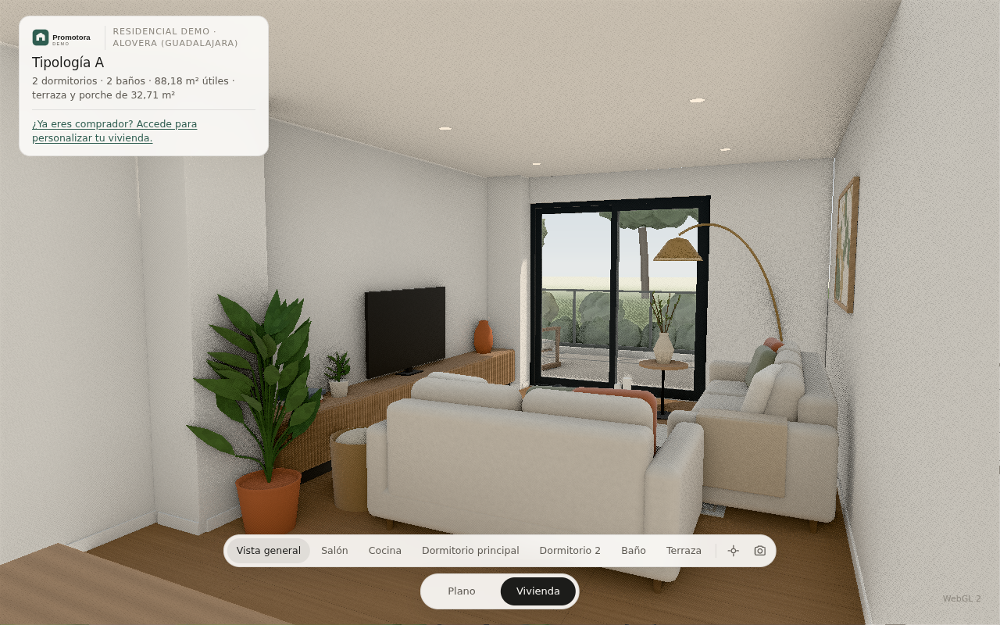 | 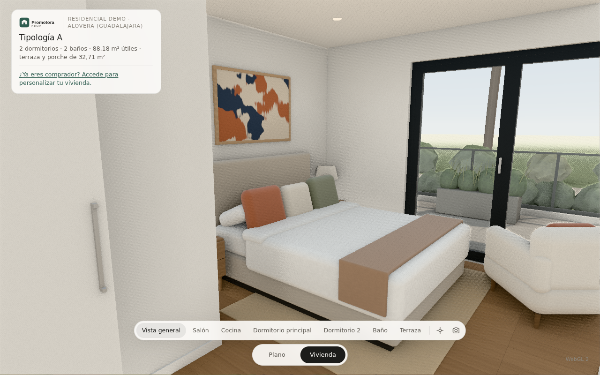 |
| 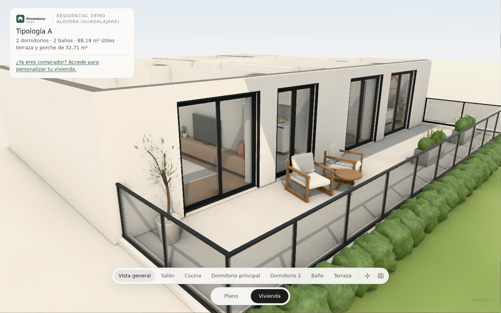 | 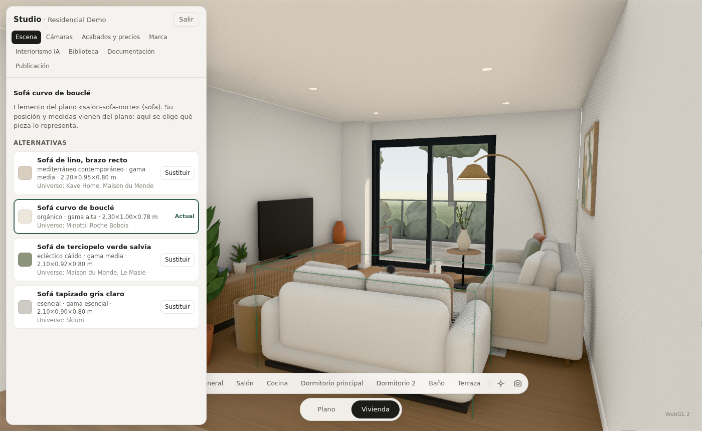 |

## Estructura: Promoción → Tipologías → Viviendas → Opciones

```
promociones/<id>/             una carpeta por promoción (instancia del producto maestro)
  promocion.json        marca blanca, promoción, tipologías (opciones admitidas) y viviendas
  catalogo.json         catálogo de opciones de la promoción (precios, parámetros, vista asociada)
  publicaciones.json    registro de versiones publicadas (v1, v2…), lo escribe la herramienta de publicación
  tipologias/a/
    vivienda.json       geometría (generada por herramientas/extraer_plano.py)
    alternativas.json   distribuciones alternativas que puede elegir el comprador (parches sobre la geometría)
    tipologia.json      cámaras maestras, vistas guiadas y extras ligados a la geometría (piscina)
biblioteca/                   biblioteca compartida del producto (activos de mobiliario y decoración)
```

**Terminología:** *variante* es una modificación fija del proyecto (por ejemplo, espejo); *alternativa* es una opción que elige el comprador al personalizar.

## Construir y publicar

| Orden | Qué hace |
|---|---|
| `npm run dev` | Web pública en local (promoción por defecto: `residencial-demo`; otra con `PROMOCION=<id>`) |
| `npm run studio` | Construcción interna con Studio (herramienta de producción; nunca se publica) |
| `node herramientas/publicacion.mjs construir <id>` | Construye la web pública de una promoción en `salida/<id>/` y comprueba que no contiene Studio ni secretos |
| `node herramientas/publicacion.mjs publicar <id> --aprobado-por "…" --cambios "…" [--confirmar]` | Publica una versión numerada en el escaparate (sin `--confirmar` solo simula) |
| `node herramientas/publicacion.mjs volver <id> vN --motivo "…" [--confirmar]` | Vuelve a una versión anterior; la vigente queda como «retirada», nunca se borra |
| `node herramientas/publicacion.mjs estado <id>` | Historial de versiones de la promoción |

El escaparate (`MUNE-Projects/escaparate`) contiene solo lo publicado: `publico/<id>/`, una carpeta por promoción, que Cloudflare sirve tal cual.

- **Una tipología por geometría distinta,** no un modelo por vivienda. Las viviendas que comparten geometría cargan la misma tipología.
- **Viviendas simétricas** (`"espejo": true`): se espejan los datos al cargar (muros, huecos, giros de puerta, mobiliario, alternativas, cámaras y piscina) en lugar de crear otro modelo.
- **Cada vivienda aporta sus datos:** referencia, planta, orientación, superficies, precio base y, si hace falta, restricciones de opciones. En el ejemplo, Bajo B no admite piscina.
- **Catálogo.** Se carga una vez por promoción. La tipología indica qué opciones admite. Una categoría con una sola opción posible no se muestra.

## Acceso de comprador sin base de datos

- Cada vivienda tiene un código privado generado de antemano: `python3 herramientas/generar_accesos.py`.
- En `promocion.json` solo se guarda el **hash SHA-256** de cada código, nunca el código en claro.
- Los enlaces para entregar a cada comprador se escriben en `accesos-privados.csv`, fuera del control de versiones.
- El enlace es `<url>#c-xxxxxxxxxxxxxxxx`. También se puede pegar el código en "Accede para personalizar tu vivienda".
- El acceso solo identifica la vivienda: qué tipología cargar y qué opciones ofrecer. No hay usuarios, contraseñas, emails ni CRM.
- **Limitación.** Es un acceso por enlace secreto, suficiente para separar la parte pública de la de comprador. No es autenticación fuerte: quien tenga el enlace, entra. Tampoco oculta el catálogo a alguien que inspeccione el código.

## Personalizar y documento de selección

- **Cajón compacto** con categorías plegables (una abierta a la vez). Al desplegar una categoría, la cámara va a la estancia afectada.
- **Resumen tipo carrito:** *Tu selección · N mejoras · +X €* y el precio total, siempre visibles.
  - Cada mejora se quita con su ×: vuelve a la opción incluida y el modelo y el precio se actualizan al instante.
  - "Restablecer" pide confirmación dentro de la propia página.
- **Documento de selección.** "Generar documento de selección" muestra el resumen y ofrece *Descargar PDF · Seguir personalizando · Cerrar*. El PDF es un documento comercial de la promotora e incluye:
  - logo y datos de la promoción;
  - ficha de la vivienda (tipología, superficies, orientación);
  - imagen de la vivienda configurada, desde la cámara maestra de la vista general;
  - vista de la distribución elegida;
  - selección por categoría, resumen económico y aviso legal de precios;
  - página de conformidad con nombre, DNI/NIE, fecha, firma y observaciones, e instrucción de firmarlo y enviarlo al comercial.
- **La configuración no se guarda en ningún sistema.** El navegador del comprador recuerda su última selección solo por comodidad.

## Marca blanca

`promocion.json › marca` define:
- logo (SVG), nombre de la promotora y colores principal y secundario;
- tipografía (Google Fonts) y favicon;
- contacto, comercial y textos legales (precios, imágenes, pie).

La interfaz (colores, tipografía, logo, favicon, título) y el PDF se generan a partir de esos datos. Los datos de ejemplo son de una promotora ficticia.

## Vistas guiadas (cámaras maestras)

- Definidas por tipología en `tipologia.json`: Vista general, Salón, Cocina, Dormitorio, Baño y Terraza, más la planta del modo Plano.
- Compuestas como fotografías comerciales: altura de ojos (1,5 m), campo contenido (55-60°) y la estancia como protagonista.
- **Transiciones:** una sola por acción. Si la cámara ya está en la vista, no se mueve. Si uno de los extremos es una vista a pie de calle, hay un fundido breve (sin vuelos verticales ni atravesar muros).
- **Render bajo demanda:** con todo quieto, la imagen se estabiliza y deja de repintarse. Así no hay temblor en ninguna vista quieta y se ahorra batería.

## Navegación y ambientación

- **Vistas guiadas** (navegación principal): Vista general, Salón · Estar, Comedor, Cocina, Recibidor, Dormitorio principal, Dormitorio 2, Baño principal, Baño secundario y Terraza.
  - **Regla** (`src/escena/vistas.ts`): toda estancia principal (vivideras, baños, recibidor y exterior) tiene al menos una vista guiada. Las estancias de 25 m² o más, o con varias zonas, tienen al menos dos.
  - Si falta alguna, se genera una automática desde la puerta de la estancia y el Studio avisa para sustituirla por una compuesta.
- **Navegación libre restringida** (`src/escena/navegacion.ts`):
  - dentro, arrastrar gira la cámara **sobre sí misma**: se puede mirar en cualquier dirección aunque esté junto a una pared;
  - se camina con la rueda, las flechas o el pellizco, y contra un muro la cámara se desliza a lo largo de él;
  - se cruzan las puertas interiores abiertas, pero no los muros, la puerta de entrada, los armarios, los muebles ni la decoración;
  - fuera, la órbita tiene límites y no deja meterse en la maqueta;
  - «Recentrar vista» devuelve a la última vista guiada.
- **Mobiliario y decoración** desde la biblioteca de activos (`biblioteca/biblioteca.json`, `src/biblioteca/`) y la ambientación de cada tipología (`ambientacion.json`).
- **Render:**
  - iluminación global en pantalla, reflejos en pantalla ponderados por el brillo de cada material, sol de tarde que entra en las estancias, cielo con nubes y horizonte, resplandor suave y gradación con viñeteado;
  - detalles: rodapiés, downlights y paisaje de zonas comunes.
- **Plano:**
  - encuadre automático en el hueco libre de la pantalla, fuera de la ficha y de la barra;
  - rótulos editoriales con halo, colocados donde no pisan muros, muebles ni otros rótulos;
  - en pantallas pequeñas pasan a un formato compacto o abreviado.

## Entregables

Todos salen de la misma base digital de la tipología (geometría, cámaras, ambientación y catálogo). Ver también [`docs/actualizacion-de-planos.md`](docs/actualizacion-de-planos.md).

- **Visor interactivo:** optimizado para fluidez.
  - Iluminación global y reflejos a calidad media, antialiasing temporal y render bajo demanda.
  - Luz de ventana con sombras, que no se cuela entre estancias.
  - Respaldo automático a WebGL 2 si WebGPU falla.
- **Render HD** (botón «Render HD», solo Promotora y Studio): la vista actual sin interfaz, con una cadena de render aparte.
  - Iluminación global con más muestras, reflejos a resolución completa y sombras a 8K.
  - Supermuestreo por desplazamiento de subpíxel y render por mosaicos.
  - Resoluciones: Web (1920 px), Alta (3840 px) e Impresión (6000 px), en 16:9 o 3:2. Formato JPEG.
- **Plano comercial** (modo Plano → «Plano comercial»): se genera desde los datos. Público y comprador descargan directamente el PDF; Promotora y Studio eligen entre PDF y PNG.
  - PDF A3 vectorial e imagen PNG a 300 ppp.
  - Logos, tipología, plano a escala normalizada (1:50) con rótulos sin solapes, tabla de superficies, leyenda, escala gráfica, norte, aviso legal y revisión del proyecto.
- **Personalización por packs** (`promocion.json → packs`): cada pack tiene título, descripción, periodo, categorías y estado.
  - *Disponible:* se puede elegir.
  - *Próximamente:* solo el nombre, el estado y un aviso neutro (sin fechas, precios ni opciones).
  - *Periodo finalizado:* histórico en gris con lo formalizado.
  - Para revisar otro momento de la promoción: `?fecha=AAAA-MM-DD`.
- **Documento por pack** (PDF): opciones e importes, total del pack, datos y DNI/NIE del comprador, firma, datos bancarios configurables (`promocion.json → pagos`) y el procedimiento: descargar → firmar → transferencia → enviar al comercial.

## Uso

```bash
npm install
npm run dev        # http://localhost:5173
npm run build      # salida estática en dist/
```

- **Modos:** barra inferior o teclas `1` (Plano), `2` (Vivienda) y `3` (Personalizar, con acceso de comprador).
- **Acceso de prueba:** los enlaces de las viviendas de ejemplo están en `accesos-privados.csv` (se generan con `python3 herramientas/generar_accesos.py`).
- **Vistas:** barra de vistas encima de los modos. También se puede orbitar libremente con el ratón.
- **Capturar imagen** (icono de cámara): renderiza la vista actual a ~2400 px con iluminación global de alta calidad, acumula 72 fotogramas y descarga un PNG.
- **Motor:** WebGPU cuando el navegador lo soporta, con respaldo automático a WebGL 2. `?webgl` fuerza WebGL 2.

## Cómo funciona

```
plano (imagen o DWG) ──► src/modelo/vivienda.json ──► generadores ──► 4 estados + imágenes
```

1. **Datos** (`src/modelo/vivienda.json`, tipos en `src/modelo/tipos.ts`). La vivienda se describe en metros:
   - muros como rectángulos,
   - huecos anclados a un muro,
   - estancias como polígonos,
   - equipamiento con su rectángulo y orientación.

   Cada dato lleva su `origen` (`plano`, `usuario`, `memoria` o `supuesto`) para saber qué es fiable y qué falta confirmar.
2. **Extracción** (`herramientas/extraer_plano.py`, `npm run plano`). Para este caso de prueba las medidas se tomaron analizando los píxeles del plano. La escala se calibró con la escala gráfica y se verificó con las superficies oficiales. En un proyecto real, este paso se sustituye por los planos acotados del cliente.
3. **Generadores** (`src/escena/`):
   - `muros.ts`: trocea cada muro en macizos y dinteles y clasifica cada cara según la estancia a la que mira (pintura, alicatado de baño o fachada). Descarta las caras ocultas.
   - `suelos.ts`: suelos, umbrales, techos (visibles desde dentro e invisibles en la vista de maqueta), volúmenes y entorno.
   - `carpinterias.ts`: puertas con cerco, tapajuntas, hoja pantografiada y manillas; balconeras correderas u oscilobatientes con guías de persiana; barandilla de vidrio.
   - `equipamiento.ts`: cocina, sanitarios y armarios modelados por código; el mobiliario y la decoración salen de la biblioteca de activos (`src/biblioteca/`).
   - `detalles.ts`: rodapiés y downlights. `paisaje.ts`: zonas comunes exteriores.
   - `navegacion.ts`: navegación libre con colisiones y límites.
   - `materiales.ts`: materiales procedurales en TSL (gres con juntas, alicatado, madera con veta, cuarzo con árido, textiles, SATE, lacados) y los uniforms que gobiernan los estados.
   - `lineas.ts`: el grafismo de planta.
   - `luz.ts`: cielo, sol e iluminación de entorno.
   - `estados.ts`: la máquina de estados y sus transiciones.
   - `camaras.ts`: las vistas predefinidas y el paso de una a otra.
4. **Configurador** (`src/configurador/`):
   - `alternativas.ts` aplica un parche de distribución sobre la vivienda base. Recalcula las superficies por diferencia de área y recoloca el equipamiento apoyado en un muro que cambia: lo ajusta al tramo que queda o lo retira, e informa de ello.
   - `configurador.ts` guarda la selección y los precios, y lleva los parámetros de cada acabado a los uniforms de los materiales con un fundido.
   - `panel.ts` genera el panel a partir del catálogo.
5. **Render** (`src/main.ts`): iluminación global en espacio de pantalla (SSGI), oclusión ambiental y antialiasing temporal (TRAA), mapeo tonal Neutral y exposición automática al entrar en la vivienda.

## Estado del caso de prueba

La fidelidad al plano, las decisiones tomadas y lo que falta confirmar están en
[`docs/analisis-y-decisiones.md`](docs/analisis-y-decisiones.md).
