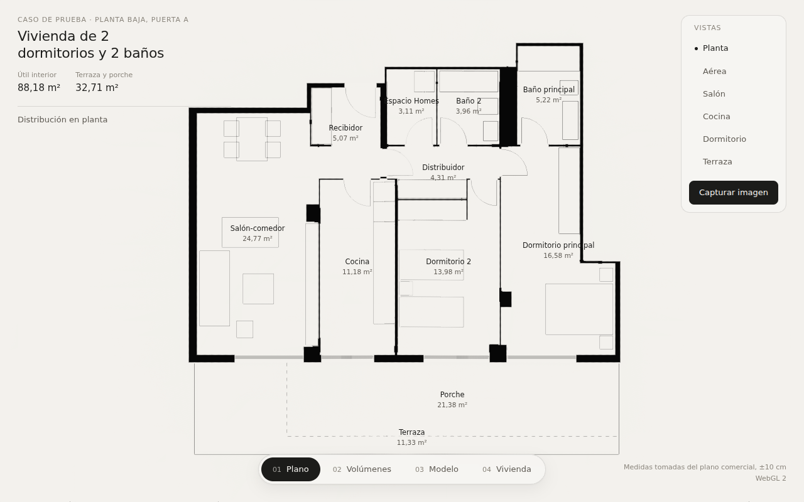
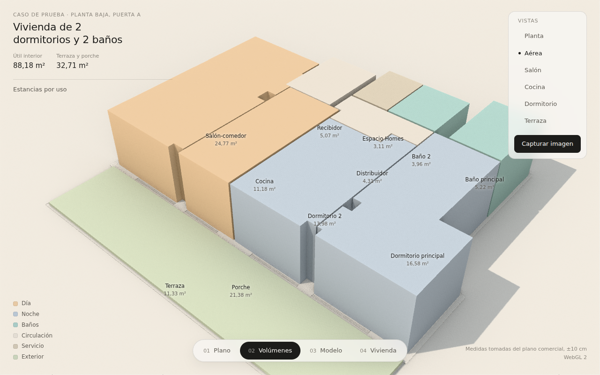
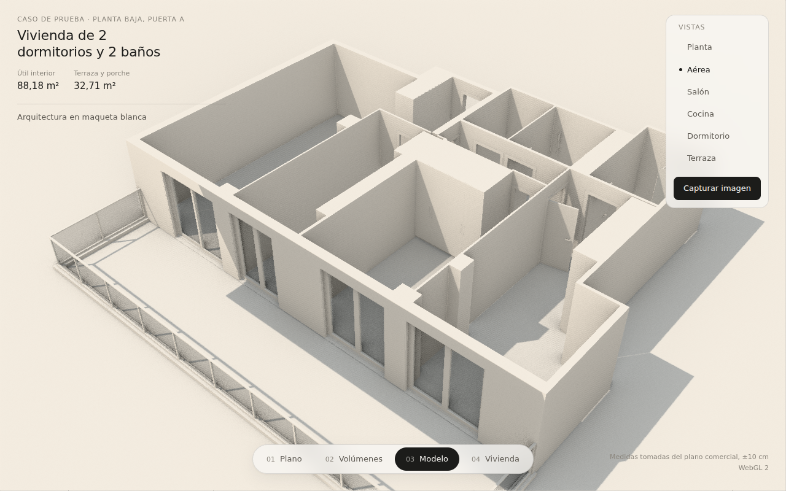
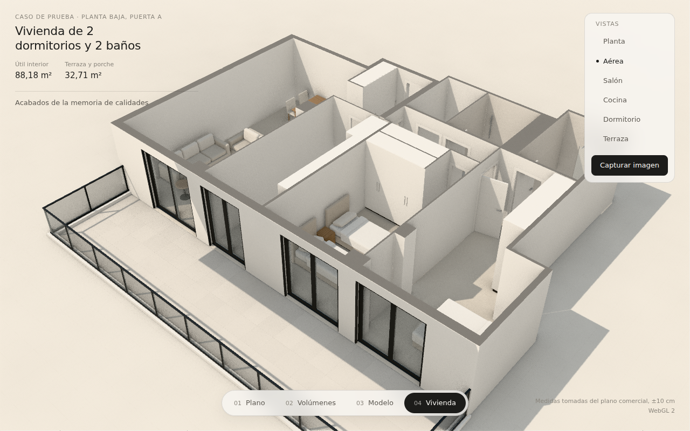
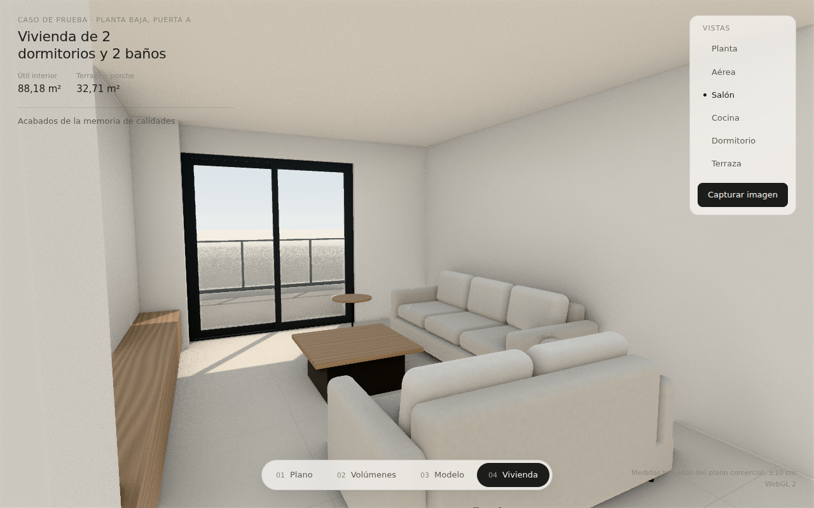
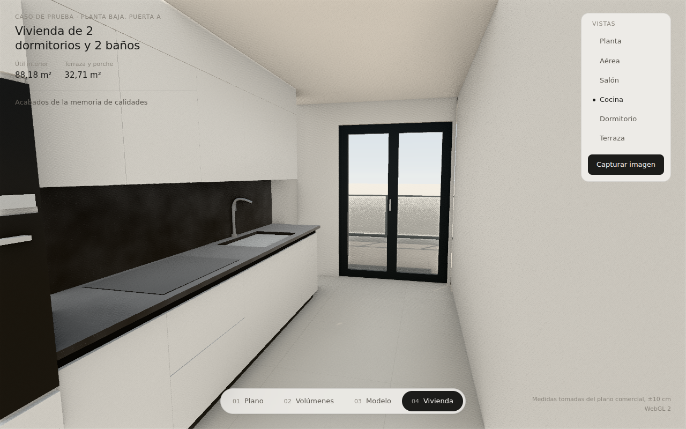

# Inmobiliarias — visualización 3D a partir de planos

Prototipo para comprobar si podemos producir visualizaciones arquitectónicas
de calidad comercial partiendo solo del plano de una vivienda. Todo se genera
por código con **Three.js + TSL**. No hay modelos 3D, texturas, HDRI ni
librerías externas aparte de `three`.

La visualización tiene cuatro estados, con transiciones animadas en ambos sentidos:

| Estado | Qué muestra |
|---|---|
| 01 Plano | Planta en papel: muros en poché, giros de puertas, carpinterías, mobiliario y superficies |
| 02 Volúmenes | Cada estancia como un volumen coloreado según su uso |
| 03 Modelo | Arquitectura en maqueta blanca: muros con huecos, carpinterías, barandilla y equipamiento fijo |
| 04 Vivienda | Acabados de la memoria de calidades, mobiliario, sol y cielo |

| | |
|---|---|
|  |  |
|  |  |
|  |  |

## Uso

```bash
npm install
npm run dev        # http://localhost:5173
npm run build      # salida estática en dist/
```

- **Estados:** botones inferiores, teclas `1`–`4` o flechas `←` `→`.
- **Vistas:** Planta, Aérea, Salón, Cocina, Dormitorio y Terraza. También se puede orbitar libremente.
- **Capturar imagen:** renderiza la vista actual a ~2400 px con iluminación global de alta calidad, acumula 72 fotogramas y descarga un PNG.
- **Motor:** WebGPU cuando el navegador lo soporta, con respaldo automático a WebGL 2. `?webgl` fuerza WebGL 2.

## Cómo funciona

```
plano (imagen o DWG) ──► src/modelo/vivienda.json ──► generadores ──► 4 estados + imágenes
```

1. **Datos** (`src/modelo/vivienda.json`, tipos en `src/modelo/tipos.ts`). La vivienda se describe en metros:
   - muros como rectángulos,
   - huecos anclados a un muro,
   - estancias como polígonos,
   - equipamiento con su rectángulo y orientación.

   Cada dato lleva su `origen` (`plano`, `usuario`, `memoria` o `supuesto`) para saber qué es fiable y qué falta confirmar.
2. **Extracción** (`herramientas/extraer_plano.py`, `npm run plano`). Para este caso de prueba las medidas se tomaron analizando los píxeles del plano. La escala se calibró con la escala gráfica y se verificó con las superficies oficiales. En un proyecto real, este paso se sustituye por los planos acotados del cliente.
3. **Generadores** (`src/escena/`):
   - `muros.ts`: trocea cada muro en macizos y dinteles y clasifica cada cara según la estancia a la que mira (pintura, alicatado de baño o fachada). Descarta las caras ocultas.
   - `suelos.ts`: suelos, umbrales, techos (visibles desde dentro e invisibles en la vista de maqueta), volúmenes y entorno.
   - `carpinterias.ts`: puertas con cerco, tapajuntas, hoja pantografiada y manillas; balconeras correderas u oscilobatientes con guías de persiana; barandilla de vidrio.
   - `equipamiento.ts`: cocina, sanitarios, armarios y mobiliario, modelados por código.
   - `materiales.ts`: materiales procedurales en TSL (gres con juntas, alicatado, madera con veta, cuarzo con árido, textiles, SATE, lacados) y los uniforms que gobiernan los estados.
   - `lineas.ts`: el grafismo de planta.
   - `luz.ts`: cielo, sol e iluminación de entorno.
   - `estados.ts`: la máquina de estados y sus transiciones.
   - `camaras.ts`: las vistas predefinidas y el paso de una a otra.
4. **Render** (`src/main.ts`): iluminación global en espacio de pantalla (SSGI), oclusión ambiental y antialiasing temporal (TRAA), mapeo tonal Neutral y exposición automática al entrar en la vivienda.

## Estado del caso de prueba

La fidelidad al plano, las decisiones tomadas y lo que falta confirmar están en
[`docs/analisis-y-decisiones.md`](docs/analisis-y-decisiones.md).
