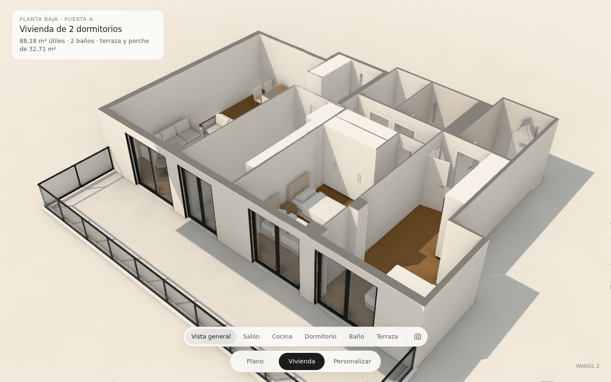
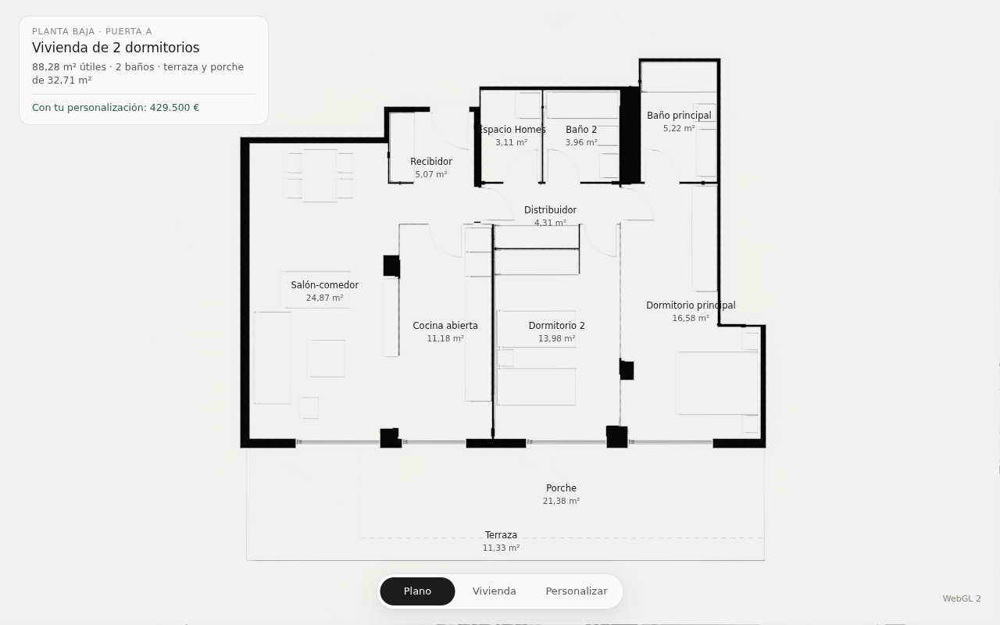
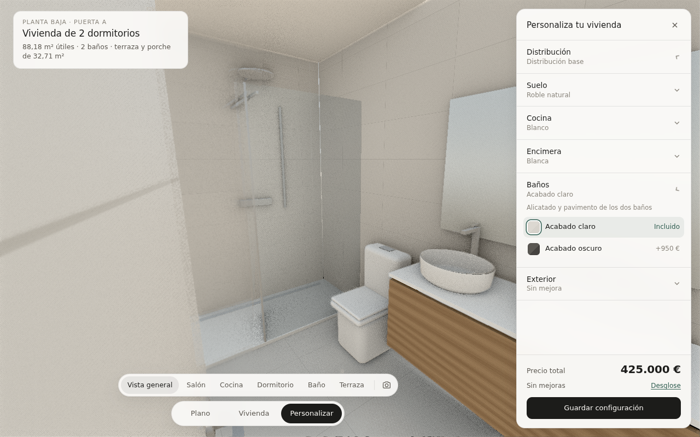
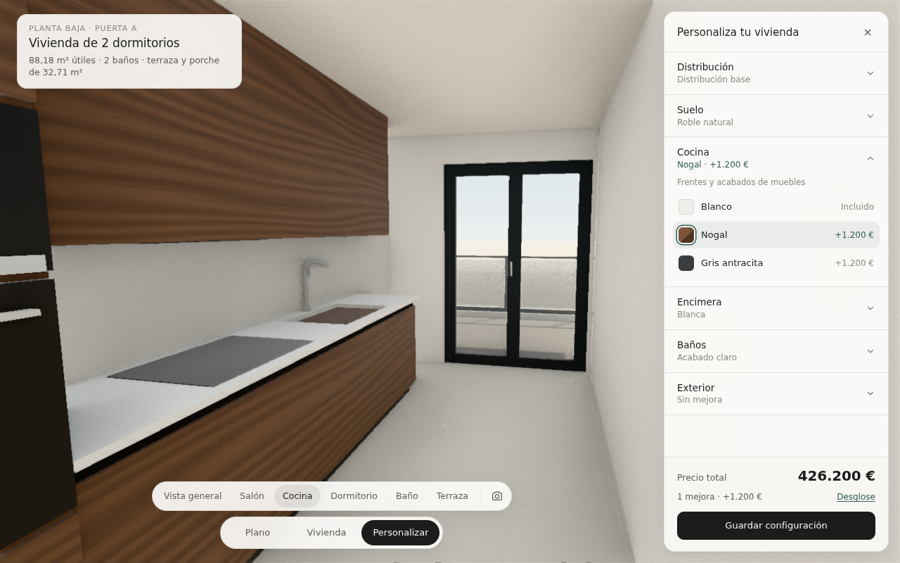
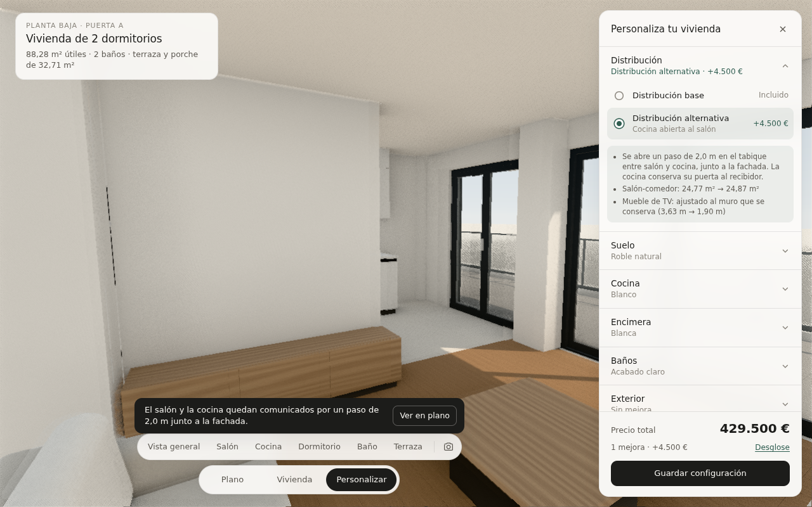
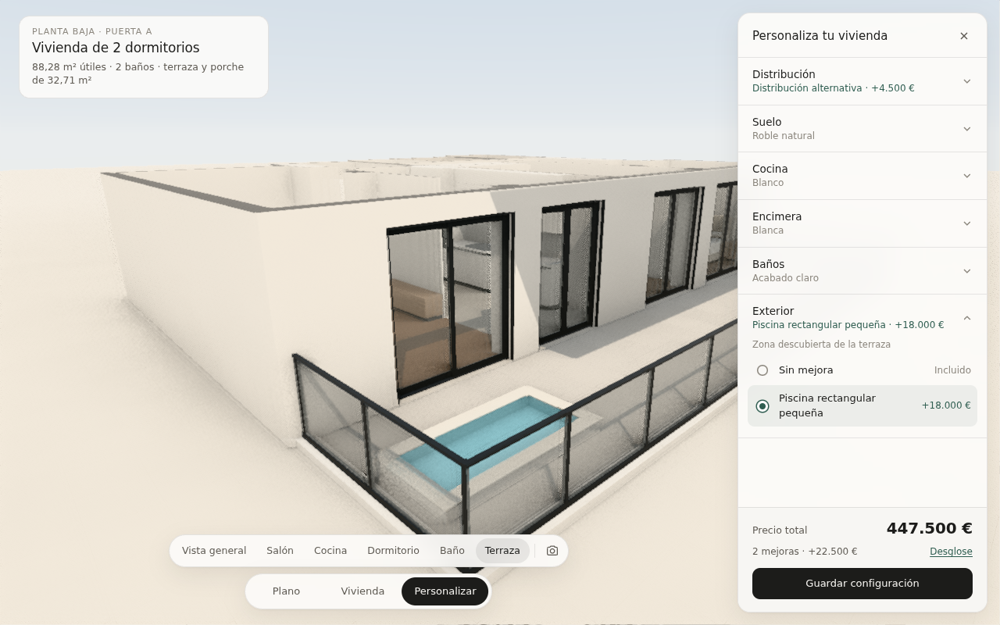

# Inmobiliarias — visualización 3D a partir de planos

Prototipo para comprobar si podemos producir visualizaciones arquitectónicas
de calidad comercial partiendo solo del plano de una vivienda. Todo se genera
por código con **Three.js + TSL**. No hay modelos 3D, texturas, HDRI ni
librerías externas aparte de `three`.

La interfaz tiene tres modos:

| Modo | Qué muestra |
|---|---|
| Plano | Planta en papel con estancias y superficies |
| **Vivienda** (principal) | La vivienda terminada, navegable, con seis vistas guiadas |
| Personalizar | La vivienda con un cajón de opciones comerciales y su precio |

Internamente se conservan los estados de construcción (volúmenes y maqueta blanca). Ya no aparecen en la interfaz, pero son el paso intermedio de la animación del plano a la vivienda.

| | |
|---|---|
|  |  |
|  |  |
|  |  |

## Vistas guiadas (cámaras maestras)

Vista general, Salón, Cocina, Dormitorio, Baño y Terraza, más la planta del modo Plano. Están definidas y congeladas en `src/escena/camaras.ts`.

**Transiciones de cámara:**
- una sola por acción, sin arcos;
- si la cámara ya está en la vista pedida, no se mueve;
- entre dos vistas a la altura de los ojos, un fundido breve en lugar de atravesar muros;
- en el resto, un desplazamiento suave.

**Con el cajón de personalización abierto:** la composición maestra se encaja entera en el hueco libre (zoom de proyección y desplazamiento del centro) sin mover la cámara. Las capturas usan el encuadre maestro.

## Personalizar

| Categoría | Opciones | Vista al abrir o cambiar |
|---|---|---|
| Distribución | base / alternativa (cocina abierta al salón) | Vista interior propia de la variante (salón hacia cocina), con aviso y acceso a "Ver en plano" |
| Suelo | roble natural / roble claro / nogal | Se mantiene |
| Cocina | blanco / nogal / gris antracita | Cocina |
| Encimera | blanca / negro granito / piedra clara | Cocina |
| Baños | claro / oscuro | Baño |
| Exterior | sin mejora / piscina rectangular pequeña | Terraza (al activarla) |

- **Cajón:** 320 px, con categorías plegables y solo una abierta a la vez. Cada cabecera muestra lo elegido y su precio.
- **Precio:** el total queda siempre visible, con el desglose plegable.
- **Guardar configuración:** muestra el resumen y lo recuerda en este navegador.

**Todo se define como datos:**
- `src/modelo/configuracion.json`: opciones, precios, parámetros y vista.
- `src/modelo/variantes.json`: distribuciones, con su propia vista explicativa.

## Uso

```bash
npm install
npm run dev        # http://localhost:5173
npm run build      # salida estática en dist/
```

- **Modos:** barra inferior o teclas `1` (Plano), `2` (Vivienda) y `3` (Personalizar).
- **Vistas:** barra de vistas encima de los modos. También se puede orbitar libremente con el ratón.
- **Capturar imagen** (icono de cámara): renderiza la vista actual a ~2400 px con iluminación global de alta calidad, acumula 72 fotogramas y descarga un PNG.
- **Motor:** WebGPU cuando el navegador lo soporta, con respaldo automático a WebGL 2. `?webgl` fuerza WebGL 2.

## Cómo funciona

```
plano (imagen o DWG) ──► src/modelo/vivienda.json ──► generadores ──► 4 estados + imágenes
```

1. **Datos** (`src/modelo/vivienda.json`, tipos en `src/modelo/tipos.ts`). La vivienda se describe en metros:
   - muros como rectángulos,
   - huecos anclados a un muro,
   - estancias como polígonos,
   - equipamiento con su rectángulo y orientación.

   Cada dato lleva su `origen` (`plano`, `usuario`, `memoria` o `supuesto`) para saber qué es fiable y qué falta confirmar.
2. **Extracción** (`herramientas/extraer_plano.py`, `npm run plano`). Para este caso de prueba las medidas se tomaron analizando los píxeles del plano. La escala se calibró con la escala gráfica y se verificó con las superficies oficiales. En un proyecto real, este paso se sustituye por los planos acotados del cliente.
3. **Generadores** (`src/escena/`):
   - `muros.ts`: trocea cada muro en macizos y dinteles y clasifica cada cara según la estancia a la que mira (pintura, alicatado de baño o fachada). Descarta las caras ocultas.
   - `suelos.ts`: suelos, umbrales, techos (visibles desde dentro e invisibles en la vista de maqueta), volúmenes y entorno.
   - `carpinterias.ts`: puertas con cerco, tapajuntas, hoja pantografiada y manillas; balconeras correderas u oscilobatientes con guías de persiana; barandilla de vidrio.
   - `equipamiento.ts`: cocina, sanitarios, armarios y mobiliario, modelados por código.
   - `materiales.ts`: materiales procedurales en TSL (gres con juntas, alicatado, madera con veta, cuarzo con árido, textiles, SATE, lacados) y los uniforms que gobiernan los estados.
   - `lineas.ts`: el grafismo de planta.
   - `luz.ts`: cielo, sol e iluminación de entorno.
   - `estados.ts`: la máquina de estados y sus transiciones.
   - `camaras.ts`: las vistas predefinidas y el paso de una a otra.
4. **Configurador** (`src/configurador/`):
   - `variantes.ts` aplica un parche de distribución sobre la vivienda base. Recalcula las superficies por diferencia de área y recoloca el equipamiento apoyado en un muro que cambia: lo ajusta al tramo que queda o lo retira, e informa de ello.
   - `configurador.ts` guarda la selección y los precios, y lleva los parámetros de cada acabado a los uniforms de los materiales con un fundido.
   - `panel.ts` genera el panel a partir del catálogo.
5. **Render** (`src/main.ts`): iluminación global en espacio de pantalla (SSGI), oclusión ambiental y antialiasing temporal (TRAA), mapeo tonal Neutral y exposición automática al entrar en la vivienda.

## Estado del caso de prueba

La fidelidad al plano, las decisiones tomadas y lo que falta confirmar están en
[`docs/analisis-y-decisiones.md`](docs/analisis-y-decisiones.md).
